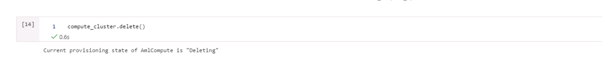

# Optimizing an ML Pipeline in Azure

## Overview
This project is part of the Udacity Azure ML Nanodegree.
In this project, we build and optimize an Azure ML pipeline using the Python SDK and a provided Scikit-learn model.
This model is then compared to an Azure AutoML run.

## Summary
The dataset is on Marketing Campaing launched by a Bank. We seek to predict whether a customer subscribed to a term deposit or not. We are taking into account the various characters of the customer including age, martial status and education

The best performing model was VotingEnsemble with 0.9175 Accuracy and it was trained using AutoML.

## Scikit-learn Pipeline
The pipeline included importing data, cleaning it, spliting it into training and test set and train a Logistic Regression Model with hyperparameter tuning for maximum accuracy. 
The data cleaning steps included converting categorical columns into numberic and the all logic for cleaning was present in train.py. 

Random Parameter Sampling was used as parameter sampler. It supports early termination of low performance runs and also helps to find the optimal parameters with low computation efforts. We applied Random Parameter sampling on parameters C and max_iter.

Bandit policy was used as early stopping policy. It is based on slack factor/slack amount and evaluation interval. Bandit terminates the run when the primary metric is not within the specific slack factor/slack amount compared to the best performing run and this helps to prevent the unnecessay computation.

## AutoML
Using the AutoML, we got VotingEnsemble Model as the best performing model with an accuracy of 91.75%. Paramters like task, primary_metrics, timeout, train_data, label, etc were passed into the AutoMLConfig to create an pipeline for AutoML.

The Hyperparameters generated by the AutoML for VotingEnsemble Model were min_samples_split=0.01, min_samples_leaf = 0.01, min_weight_fraction_leaf=0.0, n_estimators=10 and n_jobs=1.

## Pipeline comparison
The accuracy with HyperDrive Model was 91.18% and with AutML it was 91.75%. Thus, AutoML gave better result. With AutoML we trained a lot of different models and choose the best one; With HyperDrive, we were only using Logistic Regression Model.  

## Future work
- Featuring Engineering of the Data to extract more information.
- Handling Class Imbalance and understanding which metric has to be optimized.
- Using Cross validation with Accuracy.
- Use Neural Networks and Ensemble models along with Hyperparameter tuning.

## Proof of cluster clean up

